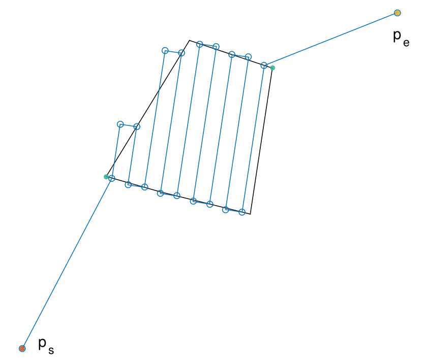

# Implementation of an Optimal Coverage Path Planner

Copyright (c) 2017, Juan Irving Vasquez-Gomez, BSD Licese
Made with support of: Consejo Nacional de Ciencia y Tecnología (CONACYT) and Instituto Politécnico Nacional (IPN), Project cátedra 1507.

Field surveying by drones has become a successful activity with applications to mapping, precision agriculture, surveillance, etc. The current state of the art path planners for surveying rely on computing the path that minimizes the number of flight lines. However, such approach could be sub-optimal when the takeoff and landing points are included in the path. We propose a method that computes the optimal path, including the takeoff and landing points. Our method is based on the rotating calipers algorithm and it has a *O(n)* complexity.

Path example:

The algorithm as been coded on matlab. In addition, the Torres's algorithm has been also implemented for comparison purposes. The code was tested for the last time on MatLab2019b.

The planner was early published as a conference paper:

> Vasquez-Gomez, J. I., Melchor, M. M., & Lozada, J. C. H. (2017, November). Optimal Coverage Path Planning Based on the Rotating Calipers Algorithm. In Mechatronics, Electronics and Automotive Engineering (ICMEAE), 2017 International Conference on (pp. 140-144). IEEE.

Later, a deeper study of the algorithm was done in our Journal paper, where we call it "the rotating calipers path planner" (RCPP):

> Juan Irving Vasquez-Gomez, Magdalena Marciano-Melchor, Luis Valentin, Juan Carlos Herrera-Lozada, Coverage Path Planning for 2D Convex Regions. Journal of Intelligent & Robotic Systems. 2019

If you are using this code in an academic work, please cite our papers. Paper preprints are available in my [web page][jivg]. If your are using this code in a commercial application please let us know, keep track on our developments and their use help us to keep releasing code.

Irving Vasquez, 2019
[jivg.org][jivg]

[jivg]: https://jivg.org/
